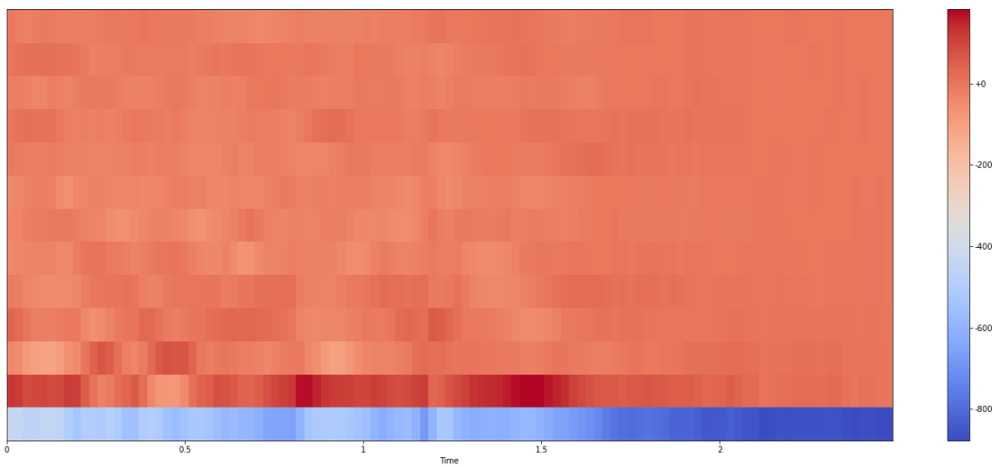
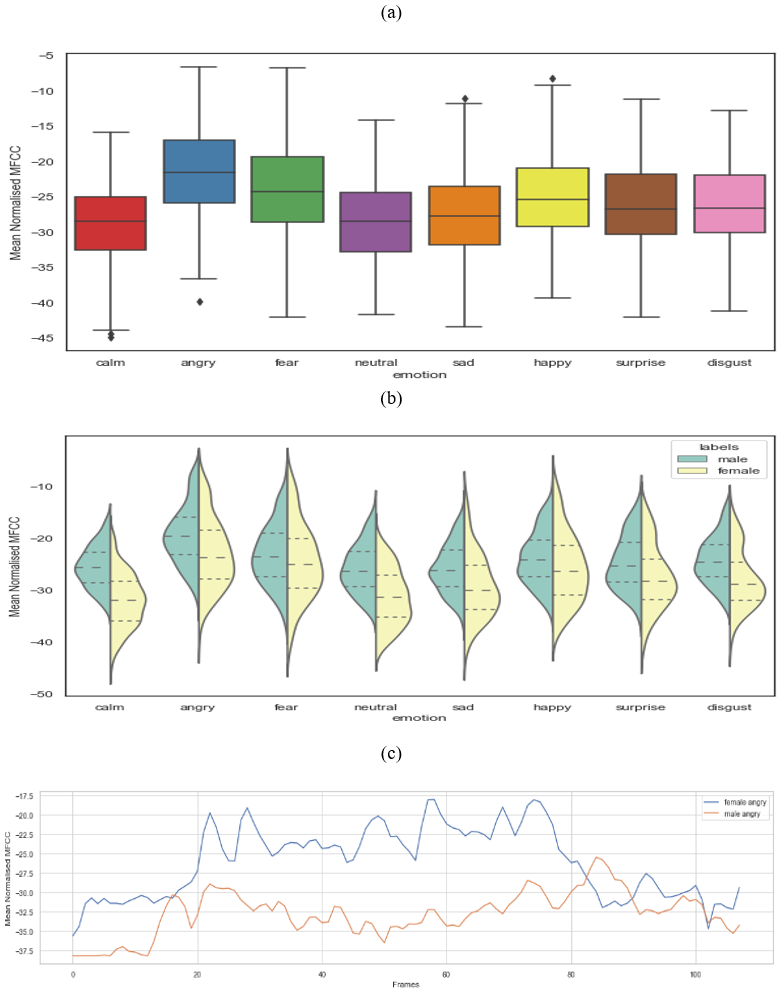
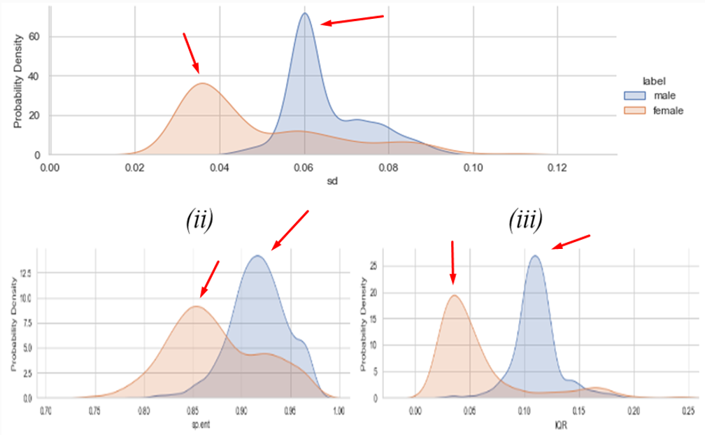
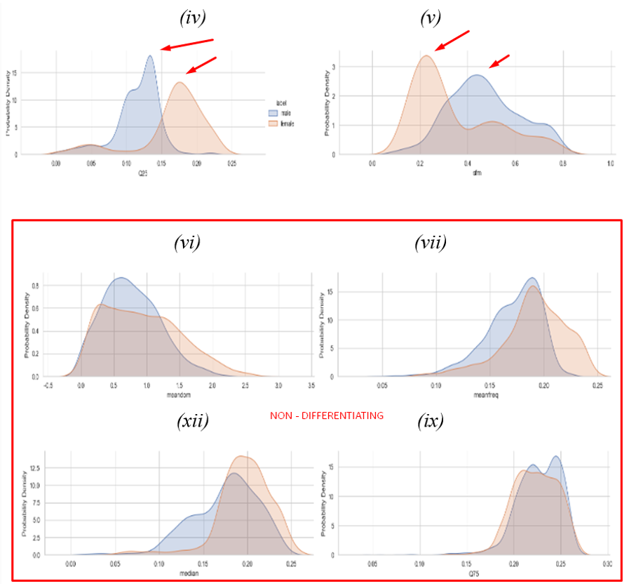

# AI-Enabled Smart Security Solution for Woman's Safety Based on Sound Analysis

Many novel approaches have been devised for safety and prevention of street
harassment for the safety of women, however, almost all of them rely on a manual trigger 
by pressing a button. Most often, considering the panic situation and the mental state of 
the victim, it is not possible by her to act efficiently. Hence, we need a hands-free 
approach a speech-based analysis of the victim and perpetrator. 
This project presents a Machine Learning approach to be
able to classify gender and emotional state of the victim and perpetrator. For gender based 
classification we use bi-classification scenario (Male and Female) and for Emotion recognition we use 8 
emotional states - Anger, Calm, Disgust, Fear, Happy, Neutral, Sad and Surprise.

Our approach differs due to the fact that we did not just focus on binary classes.
We feel humans are highly expressive and have wide range of emotional states. Hence, it is 
very improtant to consider as many emotional states as possible.

## Installation
Requirements:
* Python >= 3.8
* Jupyter Notebook

We recommend using conda for python environment management and create a virtual environment.
Create your python environment and install dependencies:

    conda create -n ravdess_analysis python=3.8 -y
    
Activate the environment by:

    conda activate ravdess_analysis
    
You may download the requirements using the requirements.txt file by following this command:

    pip install -r requirements.txt

## Dataset
This dataset has a few features that make it suitable for this project, including its size 
is sufficient for the model to be trained successfully. A model performs better the more 
data it has to work with.

* All fundamental emotional data categories are present. These emotions can be combined to detect depression and sarcasm, among other things, in further research.
* Data from two separate age groups is gathered to help with the categorisation.
* Because the audio files are mono signals, most programming libraries can convert them without experiencing any problems.
* Name of the dataset: RADVESS Dataset–Ryerson Audio Visual Database of Emotional Speech and Song
* Speech recording of 24 actors (12 male and 12 female). Even Female and Odd Male. Total audio files – 1440.
* Files are in .wav format.
* Each folder contains 60 samples.
* 8 emotional states: Neutral, Sad, Angry, Surprise, Calm, Fear, Disgust, Happy
* 2 standard statements have been used. They are:
    - Kids are talking by the door.
    - Dogs are sitting by the door.

[Dataset Credits](https://smartlaboratory.org/ravdess/)

### Filename identifiers
* Modality (01 = full-AV, 02 = video-only, 03 = audio-only).
* Vocal channel (01 = speech, 02 = song).
* Emotion (01 = neutral, 02 = calm, 03 = happy, 04 = sad, 05 = angry, 06 = fearful, 07 = disgust, 08 = surprised).
* Emotional intensity (01 = normal, 02 = strong). NOTE: There is no strong intensity for the ‘neutral’ emotion.
* Statement (01 = “Kids are talking by the door”, 02 = “Dogs are sitting by the door”).
* Repetition (01 = 1st repetition, 02 = 2nd repetition).
* Actor (01 to 24. Odd numbered actors are male, even numbered actors are female).

_Filename example_: 02-01-06-01-01-01-11.mp4

    Video-only (02)

    Speech (01)

    Fearful (06)

    Normal intensity (01)

    Statement “Kids are talking by the door” (01)

    1st Repetition (01)

    11th Actor (11)

    Female, as the actor ID number is odd.
## Block Diagram and Features List

Following features were extracted using the warbleR and the seewave packages in R.

Sr No.|	Acoustic Parameter|	Description
------|-------------------|-------------
1	|meanfreq	|Weighted avg of freq spectrum (kHz).
2	|sd	|Standard deviation (weighted standard deviation of freq spectrum) (kHz).
3 – 5|	median, Q25 (First Quartile), Q75 (Third Quartile)	|Freq spectrum divided into 2 freq intervals of - equal energy [median], 25% and 75% energy respectively [Q25], 75% and 25% energy respectively [Q75] (all in kHz)
6	|IQR (Inter Quartile Range)	|Q75 – Q25
7	|skew (skewness)	|Asymmetry in freq spectrum
8	|kurt (kurtosis)	|Peakedness of freq spectrum
9	|sp.ent (spectral entropy)	|Energy distribution of freq spectrum
10	|sfm (spectral flatness measure)	|Flatness of freq spectrum
11	|mode	|Dominant freq(kHz)
12	|centroid	|Centre of mass of spectrum
13 – 15	|meanfun, minfun, maxfun	|Avg, min & max fundamental freq measured across the acoustic signal
16 – 18	|meandom, mindom, maxdom	|Avg, min & max of dominant freq in spectrogram

### Various sound features
Feature ID|	Feature Name|	Description
----------|-------------|---------------
1	|Zero Crossing Rate 	|“The rate at which the signal changes its sign.” 
2	|Energy 	|“The sum of the signal values squared and normalized using frame length.” 
3	|Entropy of Energy 	|“The value of the change in energy.” 
4	|Spectral Centroid 	|“The value at the center of the spectrum.” 
5	|Spectral Spread 	|“The value of the bandwidth in the spectrum.” 
6	|Spectral Entropy 	|“The value of the change in the spectral energy.” 
7	|Spectral Flux 	|“The square of the difference between the spectral energies of consecutive frames.” 
8	|Spectral Rolloff 	|“The value of the frequency under which 90% of the spectral distribution occurs.” 
9-21	|MFCCs 	|“Mel Frequency Cepstral Coefficient values of the frequency bands distributed in the Mel-scale.” 
22-33	|Chroma Vector 	|“The 12 values representing the energy belonging to each pitch class.” 
34	|Chroma Deviation 	|“The value of the standard deviation of the Chroma vectors.”

## Visualization Plots

_Analyzing the amplitude of the (a) Log – Amplitude spectrogram (b) Log – Frequency spectrogram of a speech signal. The darker regions mark the regions of high energy._

_Plot of Zero – crossing rate magnified from 9000 to 9050 for an audio sample._

_MFCCs values extracted using Librosa along with unique labels_

_(a) Boxplot for emotional intensity. (b) Violin plot showing the Quartiles and mean for each type of emotion. (c) Frames vs Mean Normalized MFCC values for two audio samples of anger emotion for each gender. The graph shows clear demarcation between the emotional states in both male and female categories._

    
_1D - KDE Plots for Gender Based Classification_

* Differentiating peaks can be observed using 1D – KDE plots for various acoustic features like SFM, Q25 …etc.
* For a few of the other measures like meanfreq, meandom, median …etc we can observe non – differentiating peaks suggesting that they would not be good for gender based classification task.

## Results and Performance Evaluation

### For classification of Male and Female voice
_Result of binary classification of Male and Female classification using (a) Decision Tree Classifier (b) XGBoost (Extreme Gradient Boost). The 0 indicates female class and 1 indicates the male class._

_(a) Result for classification of emotions using Support Vector Classifier (b) Emotion Classification result using XGBoost._

* Creation of Confusion Matrix to evaluate the performance of Classification model.
* For Male and Female voice classification, we were successfully able to train the model and following results were observed:
    * Using Decision Tree Classifier, we were able to get 96% accuracy.
    * Using XGBoost classifier a 98% accuracy was attained.
* For emotion detection and classification, we were successfully able to train and test the model:
    * Using SVM classifier, we were able to get 54.39% accuracy.
    * Using XGBoost, we were able to get 69.90% accuracy.

_Confusion Matrix_

